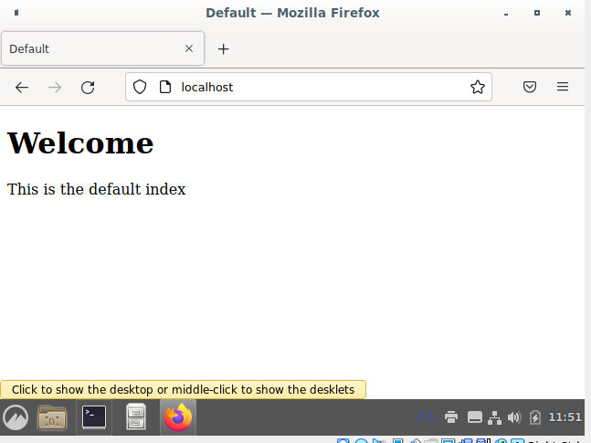

# h2 package-file-service

Part of Linux Configuration Management ICT4TN022-3015 course of Haaga-Helia University of Applied Sciences held by Tero Karvinen. Course is in Finnish.

Course page: https://terokarvinen.com/2021/configuration-management-systems-2022-spring/

## z) Lue ja tiivistä, muutama ranskalainen viiva riittää.

    SaltStack Configuration Management: Get Started Tutorial
        [Introduction](https://docs.saltproject.io/en/getstarted/config/index.html)
        [Functions](https://docs.saltproject.io/en/getstarted/config/functions.html)
        [Files](https://docs.saltproject.io/en/getstarted/config/files.html)
    [Karvinen 2008: Install Apache Web Server on Ubuntu](https://terokarvinen.com/2008/05/02/install-apache-web-server-on-ubuntu-4/index.html)
    [Apache User Homepages Automatically – Salt Package-File-Service Example](https://terokarvinen.com//2018/apache-user-homepages-automatically-salt-package-file-service-example/)
    [Pkg-File-Service – Control Daemons with Salt – Change SSH Server Port](https://terokarvinen.com//2018/pkg-file-service-control-daemons-with-salt-change-ssh-server-port/)
    [SaltStack contributors 2021: Salt system architecture](https://docs.saltproject.io/en/latest/topics/salt_system_architecture.html)  

## a) Oletussivu. Vaihda Apachen oletussivu päällekirjoittamalla /var/www/html/index.html. Voit käyttää pohjana tunnilla tekemääsi Apache-asennusta.  
  
Aloitan suoraan Salt -konfiguraatiosta, koska olen viime aikoina tehnyt tätä Apachen manuaalista asennusta todella paljon.  
Manuaalinen index.html sivun muuttaminen Linux Palvelimet 2022 -kurssin Github [sivultani](https://github.com/pajaz/Linux-Palvelimet-2022/blob/main/Homework/Lesson3/Lesson3.md#e-vaihda-apachen-esimerkkisivu-johonkin-lyhyeen-sivuun-niin-ett%C3%A4-vanha-esimerkkisivu-ei-n%C3%A4y-t%C3%A4m%C3%A4-lienee-ainoa-kohta-jossa-ikin%C3%A4-muokkaat-weppisivua-p%C3%A4%C3%A4k%C3%A4ytt%C3%A4j%C3%A4n-oikeuksin-varwwwhtmlindexhtml)
  
Lähteet:  
https://terokarvinen.com//2018/apache-user-homepages-automatically-salt-package-file-service-example/   
https://www.linode.com/docs/guides/configure-apache-with-salt-stack/  
  
1. Apache -asennus Saltilla  
  
    Avasin Master ja Minion koneeni (tässä vaiheessa vain yksi minion) ja varmistin, että salt yhteys koneilla on olemassa:  
    ```
    pajazzo@derpMaster:$ sudo salt-key
    Accepted Keys:
    numberone
    Denied Keys:
    Unaccepted Keys:
    Rejected Keys:
    pajazzo@derpMaster:$ sudo salt 'numberone' cmd.run whoami
    numberone:
        root
    ```  

    Loin Apachelle oman kansion saltin juurikansioon /srv/salt/ ja loin sille konfiguraatiotiedoston, sekä määrittelyn apache2 -paketin asennuksesta:  
    ```
    pajazzo@derpMaster:$ pwd
    /srv/salt
    pajazzo@derpMaster:$ sudo mkdir apache
    pajazzo@derpMaster:$ sudo micro apache/init.sls
    pajazzo@derpMaster:$ cat apache/init.sls 
    apache2:
    pkg.installed

    ############################################################################
    # Ajetaan äsken luotu tila state.apply -kommennolla kaikille orjille ('*') #
    ############################################################################

    pajazzo@derpMaster:$ sudo salt '*' state.apply apache
    numberone:
    ----------
            ID: apache2
        Function: pkg.installed
        Result: True
        Comment: All specified packages are already installed
        Started: 10:55:05.976885
        Duration: 49.818 ms
        Changes:   

    Summary for numberone
    ------------
    Succeeded: 1
    Failed:    0
    ------------
    Total states run:     1
    Total run time:  49.818 ms

    ######################################
    # Tarkistetaan apache2 palvelun tila #
    ######################################

    pajazzo@derpMaster:$ sudo salt '*' cmd.run 'systemctl status apache2'numberone:
    * apache2.service - The Apache HTTP Server
         Loaded: loaded (/lib/systemd/system/apache2.service; disabled; vendor preset: enabled)
         Active: inactive (dead)
           Docs: https://httpd.apache.org/docs/2.4/

    ```
    Kyseisellä minionilla Apache2 näkyisi olevan jo asennettuna, mutta palvelu ei ole käynnissä, joten muokataan apachen konfiguraatiota hieman:  
    ```
    pajazzo@derpMaster:$ sudo micro apache/init.sls  
    pajazzo@derpMaster:$ cat apache/init.sls 
    apache2:
      pkg.installed
    apache2.service:
      service.running:
        - name: apache2
    pajazzo@derpMaster:$ sudo salt '*' state.apply apache
    numberone:
    ----------
            ID: apache2
        Function: pkg.installed
        Result: True
        Comment: All specified packages are already installed
        Started: 11:12:39.307208
        Duration: 53.413 ms
        Changes:   
    ----------
            ID: apache2.service
        Function: service.running
            Name: apache2
        Result: True
        Comment: Started Service apache2
        Started: 11:12:39.362654
        Duration: 197.191 ms
        Changes:   
                ----------
                apache2:
                    True

    Summary for numberone
    ------------
    Succeeded: 2 (changed=1)
    Failed:    0
    ------------
    Total states run:     2
    Total run time: 250.604 ms

    ###########################################################
    # Testi, että Apache2 demoni tosiaan pyörii kohdekoneella #
    ###########################################################

    pajazzo@derpMaster:$ sudo salt 'numberone' cmd.run 'curl -I localhost'
    numberone:
        % Total    % Received % Xferd  Average Speed   Time    Time     Time  Current
                                        Dload  Upload   Total   Spent    Left  Speed
        
        0     0    0     0    0     0      0      0 --:--:-- --:--:-- --:--:--     0
        0 10701    0     0    0     0      0      0 --:--:-- --:--:-- --:--:--     0
        HTTP/1.1 200 OK
        Date: Tue, 12 Apr 2022 08:21:24 GMT
        Server: Apache/2.4.53 (Debian)
        Last-Modified: Mon, 04 Apr 2022 22:14:23 GMT
        ETag: "29cd-5dbdb73654831"
        Accept-Ranges: bytes
        Content-Length: 10701
        Vary: Accept-Encoding
        Content-Type: text/html

    ```  
    Palvelu on nyt käynnissä.  
      
2. Oletussivun muokkaus Salt-konfiguraatiolla  
      
    Loin saltin apache -sijaintiin html5 -oletusetusivun:  
    ```
    pajazzo@derpMaster:$ sudo mkdir apache/files
    pajazzo@derpMaster:$ sudo micro apache/files/default-index.html
    pajazzo@derpMaster:$ cat apache/files/default-index.html 
    <!DOCTYPE html>
    <html lang="en">
        <meta charset="UTF-8">
        <title>Default</title>
        <meta name="viewport" content="width=device-width,initial-scale=1">
        <body>
            <div>
                <h1>Welcome</h1>
                <p>This is the default index</p>
            </div>
        </body>
    </html> 
    ```
      
    Seuraavaksi lisäsin tiedoston apachen salt-konfiguraatioon ja ajoin tilapäivityksen:  
    ```
    pajazzo@derpMaster:$ sudo micro apache/init.sls 
    apache2:
      pkg.installed
    /var/www/html/index.html:
      file.managed:
        - source: salt://apache/files/default-index.html # /srv/salt/..
    apache2.service:
      service.running:
        - name: apache2
    pajazzo@derpMaster:$ sudo salt '*' state.apply apache
    numberone:
    ##############################################
    # Karsittu palaute, koska se oli kovin pitkä #
    ##############################################
    ----------
          ID: /var/www/html/index.html
        Function: file.managed
        Result: True
        Comment: File /var/www/html/index.html updated
        Started: 11:48:33.798040
        Duration: 31.09 ms
    Summary for numberone
    ------------
    Succeeded: 3 (changed=1)
    Failed:    0
    ------------
    Total states run:     3
    Total run time: 116.7
    ```
    Kuvakaappaus orjalta 'numberone':  
      
  
3. Apachen lisäys saltin peruskonfiguraatioon.  
  
Edelliset kohdat todettu toimiviksi, joten lisätään apache vielä saltin top.sls tiedostoon, jotta salt osaa hakea apachen asetukset oikeasta kansiosta, kun tila päivitetään.  
  
```
pajazzo@derpMaster:$ sudo micro top.sls 
#####################
/srv/salt/top.sls 
base:             
  '*':             
    - apache       
#####################
pajazzo@derpMaster:$ sudo salt '*' state.apply
numberone:
----------
          ID: apache2
    Function: pkg.installed
      Result: True
     Comment: All specified packages are already installed
     Started: 11:58:24.488848
    Duration: 50.054 ms
     Changes:   
----------
          ID: /var/www/html/index.html
    Function: file.managed
      Result: True
     Comment: File /var/www/html/index.html is in the correct state
     Started: 11:58:24.541643
    Duration: 18.883 ms
     Changes:   
----------
          ID: apache2.service
    Function: service.running
        Name: apache2
      Result: True
     Comment: The service apache2 is already running
     Started: 11:58:24.561110
    Duration: 37.752 ms
     Changes:   

Summary for numberone
------------
Succeeded: 3
Failed:    0
------------
Total states run:     3
Total run time: 106.689 ms

```
  
Nyt siis apachen -konfiguraatiota ei tarvitse erikseen ajaa vaan se ajetaan yleiskonfiguraation mukana, koska se on määritettynä top.sls tiedostoon.  


## b) Tri Kaaaos. Aiheuta erilaisia vikatilanteita ja osoita, kuinka Apache-tilasi korjaa ne. Voit esimerksi sulkea demonin (sudo systemctl stop foobar), poistaa asetukset tai poistaa apachen paketit. Osoita yksinkertaisin testein, saat palvelun toimimattomaksi, ja salt-tilasi saa sen jälleen toimimaan.
   
Sammutetaan orja koneella apache2 -palvelu:    
```
pajazzo@derpSlave1:$ sudo systemctl stop apache2.service
pajazzo@derpSlave1:$ curl -I localhost
curl: (7) Failed to connect to localhost port 80: Connection refused
```
  
Masterilla ajettu tilat uudelleen:  
```
pajazzo@derpMaster:$ sudo salt '*' state.apply
----------
          ID: apache2.service
    Function: service.running
        Name: apache2
      Result: True
     Comment: Started Service apache2
     Started: 12:12:01.760995
    Duration: 127.805 ms
     Changes:   
              ----------
              apache2:
                  True

Summary for numberone
------------
Succeeded: 3 (changed=1)
Failed:    0
------------
Total states run:     3
Total run time: 200.487 ms

#################################################################
# Testataan 'curl -I localhost' kommennolla onko palvelu elossa #
################################################################# 

pajazzo@derpMaster:$ sudo salt 'numberone' cmd.run 'curl -I localhost'
numberone:
      % Total    % Received % Xferd  Average Speed   Time    Time     Time  Current
                                     Dload  Upload   Total   Spent    Left  Speed
    
      0     0    0     0    0     0      0      0 --:--:-- --:--:-- --:--:--     0
      0   270    0     0    0     0      0      0 --:--:-- --:--:-- --:--:--     0
    HTTP/1.1 200 OK
    Date: Tue, 12 Apr 2022 09:13:34 GMT
    Server: Apache/2.4.53 (Debian)
    Last-Modified: Tue, 12 Apr 2022 08:48:33 GMT
    ETag: "10e-5dc71203cc4a1"
    Accept-Ranges: bytes
    Content-Length: 270
    Vary: Accept-Encoding
    Content-Type: text/html

```
Tämä vika tuli korjattua, eli tältä osin asetukset kunnossa. Testasin seuraavaksi poistaa orjalta apache2 paketit kokonaan.  
```
pajazzo@derpSlave1:$ sudo apt-get purge apache2*
pajazzo@derpSlave1:$ sudo systemctl stop apache2
pajazzo@derpSlave1:$ sudo systemctl status apache2
Unit apache2.service could not be found.
```
Apache2 palvelua ei siis enää ole, mikä riittää osoitukseksi virhetilasta.  
  
Ajoin tilat uudelleen masterilta:  
```
pajazzo@derpMaster:$ sudo salt '*' state.apply
numberone:
----------
          ID: apache2
    Function: pkg.installed
      Result: True
     Comment: The following packages were installed/updated: apache2
     Started: 12:43:03.577627
    Duration: 10312.015 ms
     Changes:   
              ----------
              apache2:
                  ----------
                  new:
                      2.4.53-1~deb11u1
                  old:
              apache2-bin:
                  ----------
                  new:
                      2.4.53-1~deb11u1
                  old:
              apache2-data:
                  ----------
                  new:
                      2.4.53-1~deb11u1
                  old:
              apache2-utils:
                  ----------
                  new:
                      2.4.53-1~deb11u1
                  old:
----------
          ID: /var/www/html/index.html
    Function: file.managed
      Result: True
     Comment: File /var/www/html/index.html is in the correct state
     Started: 12:43:13.891982
    Duration: 37.526 ms
     Changes:   
----------
          ID: apache2.service
    Function: service.running
        Name: apache2
      Result: True
     Comment: Started Service apache2
     Started: 12:43:13.939127
    Duration: 166.553 ms
     Changes:   
              ----------
              apache2:
                  True

Summary for numberone
------------
Succeeded: 3 (changed=2)
Failed:    0
------------
Total states run:     3
Total run time:  10.516 s
```
  
Kuten tulosteesta huomataan, Salt asensi apache2 paketit uudelleen ja käynnisti apache2 -palvelun. index.html tiedostoon ei tarvinnut koskea, koska aiemmin tehty apache2* purge ei koskenut kyseiseen tiedostoon. Tiedosto oli siis muuttumaton, joten mitään ei tarvinnut tehdä.  
Aikaa tähän kului huomattavasti pidempään, kuin aiempiin ajoihin, koska paketteja tarvitsi oikeasti ladata ja asentaa.  
  
## c) Shh! Asenna ja konfiguroi SSH-demoni. Laita se porttiin 7373.
Debian 11 uuden openssh asennuksen konfiguraation sijainti: 
/etc/ssh/sshd_config  

1. Openssh manuaalinen asennus  
    Aloitin asentamalla openssh-palvelimen manuaalisesti orjalle: 
    `pajazzo@derpSlave1:$ sudo apt-get install openssh-server`
    
    Asennuksen tulosteesta selvisi konfiguraatio-tiedoston sijainti:  
    `Creating config file /etc/ssh/sshd_config with new version`  
    Vaihdoin kyseisestä tiedostosta Port -arvon halutuksi:  
    ```
    pajazzo@derpSlave1:$ sudo micro /etc/ssh/sshd_config
    pajazzo@derpSlave1:$ cat /etc/ssh/sshd_config |grep Port
    Port 7373
    ```  
    Käynnistin ssh-palvelun uudelleen, koska konfiguraatio on muuttunut:  
    `pajazzo@derpSlave1:$ sudo systemctl restart sshd`

    SSH-yhteyden testaus masterilta:  
    `pajazzo@derpMaster:$ ssh pajazzo@192.168.1.8 -p 7373`
    Yhteys onnistui.  
  
2. Openssh asetukset Saltiin  

    Aloitin luomalla sshd konfiguraatiotiedoston, joka vain varmistaa openssh-palvelimen asennuksen aluksi:  
    ```
    pajazzo@derpMaster:$ sudo micro sshd.sls
    ###############
    openssh-server:
      pkg.installed
    ###############
    pajazzo@derpMaster:$ sudo salt '*' state.apply sshd
    ```
    Tilat ajettiin onnistuneesti. Koska kyseisellä orjalla oli jo asennettuna paketti, ei muutoksia vaadittu.  
      
    Jatkoin hakemalla konfiguraatiotiedoston sisällön minionilta, luomalla siitä version masterille ja lisäämällä tiedoston hallinnoituihin tiedostoihin:  
    ```
    pajazzo@derpSlave1:$ cat /etc/ssh/sshd_config
    pajazzo@derpSlave1:$ exit
    logout
    Connection to 192.168.1.8 closed
    pajazzo@derpMaster:$ pwd
    /srv/salt
    pajazzo@derpMaster:$ sudo micro sshd_config ## Tänne kopioitiin sisältö orjan tiedostosta
    pajazzo@derpMaster:$ sudo micro sshd.sls 
    pajazzo@derpMaster:$ cat sshd.sls 
    openssh-server:
      pkg.installed
    /etc/ssh/sshd_config:
      file.managed:
        - source: salt://sshd_config
    ```
     
    Tilan päivitys:  
    `pajazzo@derpMaster:$ sudo salt '*' state.apply sshd`


## m) Vapaaehtoinen: Asenna ja konfiguroi Nginx-weppipalvelin.

Vinkkejä

    Ensin käsin, vasta sitten automaattisesti. Raportoi myös käsin (perinteisillä Linux-komennoilla) tekemäsi testit.
    SSH-demoni löytyy paketista openssh. Kun saat sen vastaamaan uudesta portista, sinulla on valmis mallitiedosto jaettavaksi masterilta. Katso myös /etc/ssh/sshd_config, 'man ssh' ja 'man sshd_config'.
    Kirjoittamani esimerkki sshd:n säätämisestä on vanhemmalle versiolle, jonka asetustiedosto tuskin toimii sellaisenaan. Mistä löytyisi tuoreempi...
    Jos haluat lähettää kokonaisia tiedostoja orjille, laita ne samaan hakemistoon masterilla init.sls kanssa. Jos masterilla tiedosto on "/srv/salt/heitero/tero.txt", siihen viitataan file.managed source parametrilla "salt://heitero/tero.txt". Eli tuo "protokolla" salt:// tarkoittaa oikeastaan masterin /srv/salt/-hakemistoa.
    Vaikeita kohtia? Ratko kaikki mitä osaat, raportoi ja palauta ajoissa. Vaikeasta tai kesken jääneestä kohdasta erityisen tarkka raportti: mitä teit, mitä tapahtui. Ota ruutukaappaukset ja sanatarkat virheilmoitukset talteen. Mistä arvelet ongelman johtuvan? Mitä ratkaisuvaihtoehtoja vielä voisi kokeilla? Löydätkö (esim virheilmoituksella hakemalla) lähteitä, joissa ehdotetaan ratkaisuja? Ja katsotaan yhdessä tunnilla loput.
