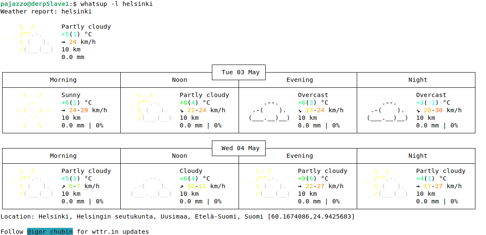

# h5 Uusi komento

Part of Linux Configuration Management ICT4TN022-3015 course of Haaga-Helia University of Applied Sciences held by Tero Karvinen. Course is in Finnish.  

Course page: https://terokarvinen.com/2021/configuration-management-systems-2022-spring/  

## a) Hei komento! Tee järjestelmään uusi "hei maailma" -komento ja asenna se orjille Saltilla. Liitä raporttiisi 'ls -l /usr/local/bin/' tulosteesta ainakin se rivi, jolla näkyy uuden komentotiedostosi oikeudet. Vinkkejä: tee shell script, joka tulostaa "hei maailma". Kokeile ensin käsin, sitten automatisoi. Luonteva paikka paketinhalllinnan ulkopuolelta asennetuille ohjelmille on /usr/local/bin/. Katso myös 'salt-call --local sys.state_doc file.managed'. Muista (aina ja kaikessa mitä teet tietokoneella) testata lopputulos. Hyvä testi on mahdollisimman lähellä sitä, mitä käyttäjä tekisi.

Luotu skripti, asetettu sen oikeudet kuntoon eli käyttäjä, käyttäjän ryhmä ja muut saavat suorittaa ja lukea tiedoston, sekä testattu sen toiminta: 
```
$ mkdir scriptVault
$ cd scriptVault/
$ sudo micro helloworld

#!/bin/bash

echo 'Hello world'

$ sudo chmod 755 helloworld.sh
$ sudo cp helloworld /usr/local/bin/helloworld
$ ls -l /usr/local/bin/helloworld 
-rwxr-xr-x 1 root root 32  3. 5. 10:38 /usr/local/bin/
$ helloworld
Hello world
```

Luotu salt tila nimeltä helloworld ja siirretty testattu skripti tilan juureen, ja ajettu tila orjille: 
```
$ cd /srv/salt
$ sudo mkdir helloworld
$ sudo micro init.sls

/usr/local/bin/helloworld:
  file.managed:
    - source: salt://helloworld/helloworld

### Luulen, että tähän pitää vielä määrittää tiedoston oikeudet erikseen, jotta käyttäjät voivat ajaa skriptin, mutta testaan ensin ilman

$ sudo cp /usr/local/bin/helloworld helloworld
$ sudo salt '*' state.apply helloworld
``` 

Koska palautetuloste on aika pitkä, en esitä sitä tässä. Kuitenkin tila ajettiin onnistuneesti molemmille orjille ja uusi tiedosto luotiin.

Testi orjalla ja tosiaan oikeudet eivät riittäneet:
```
Slave1:$ helloworld
bash: /usr/local/bin/helloworld: Permission denied
```

Muokkasin tilaan oikeudet kuntoon ja ajoin sen uudelleen:
```
$ cat init.sls 
/usr/local/bin/helloworld:
  file.managed:
    - source: salt://helloworld/helloworld
    - mode: 755
$ sudo salt '*' state.apply helloworld
# Tila ajettiin onnnistuneesti ja tiedostoon tehtiin yksi muutos
```

Testi orjalla ja tällä kertaa kaikki toimii kunnolla:
```
Slave1:$ helloworld 
Hello world
```

Saltin kautta hallinnoitujen tiedostojen oikeudet tulevat siis automaattisesti kohdekansion oikeuksien mukaan, jos ei toisin ole määritelty mode -muuttujalla.  


## b) whatsup.sh. Tee järjestelmään uusi komento, joka kertoo ajankohtaisia tietoja; asenna se orjille. Vinkkejä: Voit näyttää valintasi mukaan esimerkiksi päivämäärää, säätä, tietoja koneesta, verkon tilanteesta...

Tein simppelin skriptin joka kertoo tämän ja huomisen sään käyttäjän sijainnissa tai tämän itse määrittämässä sijainnissa. Asetin jälleen tiedoston oikeudet chmod 755 asetuksella oikein, siirsin /usr/local/bin sijaintiin ja testasin toiminnan.

Tämän jälkeen loin uuden salt -tilan whatsup, asetukset hyvin samankaltaisesti edellisen kohdan kanssa (vain eri polut) ja siirsin skripti-tiedoston whatsup tilan sijaintiin.

Ajoin tilan orjille onnistuneesti ja testasin yhdellä orjalla toimintaa:  
```
Slave1:$ whatsup -h
whatsup will show you today's and tomorrow's weather details in the location of your choosing.
Information is delivered from https://wttr.in (not associated)

Syntax: whatsup [-h|-l <location>]
options:
-h 		Show this help page
-l <location> 	Show weather for the specified location 

If no options are provided the default is your current location

Example:
whatsup -l helsinki
```
  

  
## c) hello.py. Tee järjestelmään uusi komento Pythonilla ja asenna se orjille. Vinkkejä: Hei maailma riittää, mutta propellihatut saavat toki koodaillakin. Shebang on "#!/usr/bin/python3". Helpoin Python-komento on: print("Hei Tero!")

Ei valitettavasti tässä vaiheessa tule mieleen oikein mitään, mitä haluaisin tehdä pythonilla, jota en pystyisi tekemään bash-skripteillä eli mennään hello worldilla.

Käytän tiedoston jakamiseen samaa helloworld -tilaa jonka loin aiemmassa tehtävässä. Lisään myös tilaan tarkistuksen, että python3 paketti on asennettuna orjalle.

Aloitin tekemällä skriptin:
```
#!/usr/bin/python3

print("Hello!")
```

Tallensin ja tein edellisistä kohdista tutut chmod -oikeuksienmuokkaukset, testin masterilla, tiedoston kopioinnit ja tilan luonnin:  
```
$ cat init.sls 
/usr/local/bin/helloworld:
  file.managed:
    - source: salt://helloworld/helloworld
    - mode: 755
/usr/local/bin/hello:
  file.managed:
      - source: salt://helloworld/hello
      - mode: 755
python3:
  pkg.installed
```

Ajoin tilat orjille onnistuneesti ja testasin toimintaa. Komentorivi tervehtii minua hello komennolla, kuten pitääkin.  

## d) Laiskaa skriptailua. Tee kansio, josta jokainen skripti kopioituu orjille. Vinkki: 'salt-call --local sys.state_doc file.recurse'. Kun tämä on valmis, on todella helppoa laittaa orjille mikä tahansa yhden tiedoston shell script, Python-ohjelma, Perl-ohjelma, Go-binääri tai muu yhden binäärin ohjelma.

Aloitin luomalla tilan saltiin ja siirsin aiemmin tässä dokumentissa luodut skriptit luodun tilan sijaintiin: 
```
$ cd /srv/salt/
$ ls
apache  commonpkg-set  firefox  helloworld  sshd  top.sls  ufw  whatsup
$ sudo mkdir userscripts
$ cd userscripts/
$ sudo mkdir scripts
$ sudo micro init.sls
$ cat init.sls 
/usr/local/bin:
  file.recurse:
    - source: salt://userscripts/scripts
    - file_mode: 755
$ sudo cp /srv/salt/helloworld/hello /srv/salt/helloworld/helloworld /srv/salt/whatsup/whatsup scripts/
$ ls scripts/
hello  helloworld  whatsup
```

Lähde file.recurse käytölle: salt-call --local sys.state_doc file.recurse

Ajoin tilan orjille `$ sudo salt '*' state.apply userscripts`, mutta muutoksia ei tarvinnut tehdä, koska tiedostot olivat jo olemassa. Testasin tilan toimintaa tyhjentämällä yhdeltä orjalta kohdekansion sijainnin:
```
$ sudo salt 'numberone' cmd.run 'rm /usr/local/bin/*'
numberone:
$ sudo salt 'numberone' cmd.run 'ls -l /usr/local/bin'
numberone:
    total 0
```

Orjan puolella huomataan, että komennot tosiaan poistuivat:
```
Slave1:$ hello
bash: /usr/local/bin/hello: No such file or directory
Slave1:$ helloworld
bash: /usr/local/bin/helloworld: No such file or directory
Slave1:$ whatsup
bash: /usr/local/bin/whatsup: No such file or directory
```

Tilojen uudelleenajon jälkeen kaikki toimi taas normaalisti:
```
Slave1:$ hello
Hello!
Slave1:$ helloworld 
Hello world
Slave1:$ whatsup 
Weather report: Tallinn, Estonia
``` 
   
Lisäsin vielä python3 paketin aiemmalla viikolla tekemääni commonpkg-set tilaan, jotta sen asennus tulisi tehtyä kaikille koneille. En usko, että on järkevää tehdä samoja asetuksia kahteen tiedostoon, joten jätin pythonin asennuksen tarkistuksen pois tästä userscripts -tilasta.  
  
## e) Intel. Etsi kolme loppuprojektia joltain vanhalta kurssitoteutukselta. Kuvaile projektit tiiviisti ja linkitä alkuperäiseeen raporttin. Vinkkejä: Loppuprojekteja löydät etsimällä opiskelijoiden raportteja vanhoilta kursseilta ja selailemalla sivuja, joilta ne löytyivät. Raportteja löytyy vanhojen kurssitotetusten kommenteista. Ja tietysti kannattaa silmäillä listaa sieltä täältä, niin näet eri projektit kuin muut. Voi hakea myös Googlella ja DuckDuckGolla.
  
Syksy 2020 toteutuksen loppuprojekti:  
https://heiskanen.rocks/server_management/h7
  
Projektin tavoitteena on luoda useita proxyja ympäri maailmaa joita voidaan käyttää proxychains4 kanssa ohjaamaan verkkoliikennettä välityspalvelinten kautta.  
  
- Teknisesti ainakin omalle osaamiselleni haastava projekti, jossa käytetään useita tekniikoita, joista itse en ole kuullutkaan, kuten salt-cloud ja useita eri sovelluksia/kirjastoja.  
- Tämän parempi ymmärtäminen vaatisi siis enemmän pohjatietoja, kuin mitä tässä kurssin toteutuksessa on tullut vastaan.  
  
Syksy 2020 toteutuksen loppuprojekti:  
https://linuxwithkunnas.wordpress.com/2020/12/17/viikko-7-moduuli-harjoitustyo/  
  
"Tarkoituksena on toteuttaa Saltilla tila, jossa asennetaan useampia ohjelmia orjakoneeseen tai koneille ja osaan ohjelmista mukautetut oletuasetukset / asetustiedostot."

- Erittäin kattava raportti saltilla sovellusten asennuksesta, asetusten teosta ja käyttäjien luonnista.  
- Kirjoittaja käy myös läpi useita asetuksissa vastaantulleita ongelmatiloja sekä niiden selvitystä ja ratkaisuja.     
  
Kevät 2021 toteutuksen loppuprojekti:  
https://ottohanninen.wordpress.com/2021/05/19/configuration-management-systems-palvelinten-hallinta-spring-2021-h7-oma-moduli/
  
LAMP-stackin, SSH:n ja UFW:n asennus ja konfigurointi  
  
- Lyhyt ja ytimekäs. Raportti selittää pääpiirteissään kuvatun stackin ja sovellusten asetukset saltilla.  


## e) Lukua, ei luottamusta. Kokeile yhtä kohdassa d-Intel löytämääsi modulia koneella. Tämä on infraa koodina, joten luottamusta ei tarvita. Voit lukea koodista, mitä olet ajamassa.   
  
Valitsin edellisen tehtävän kolmannen linkin, koska siinä asennetut sovellukset ovat itselleni tuttuja, eikä asennuksessa ole mitään useamman gigatavun paketteja.  
  
Linkki moduuliin: https://github.com/ottohan/LAMP  
  
Aloitan asentamalla Vagrantilla kaksi uutta virtuaalikonetta (t001 ja t002) tätä testausta varten.
- https://terokarvinen.com/2021/two-machine-virtual-network-with-debian-11-bullseye-and-vagrant/

```
$ cd Projects/vagranthosts/
$ ls
shared  Vagrantfile
$ vagrant up
```
  
Otin molemmille koneille oman terminaalin auki ja asensin t001 koneelle salt-masterin, t002 koneelle salt-minionin.

Määritin master koneen orjan minion -konfiguraatioon ja uudelleen käynnistin salt-minion palvelun:
```
## Minion
vagrant@t002:~$ sudo nano /etc/salt/minion
master: 192.168.88.101 # t001 ip-osoite
id: t002
vagrant@t002:~$ sudo systemctl restart salt-minion.service 

## Master
vagrant@t001:~$ sudo salt-key -A
The following keys are going to be accepted:
Unaccepted Keys:
t002
Proceed? [n/Y] Y
Key for minion t002 accepted.
vagrant@t001:~/LAMP-main$ sudo salt '*' test.ping
t002:
    True
```

Moduuliin haku koneelle ja käyttöönotto sellaisenaan:
```
vagrant@t001:~$ wget https://github.com/ottohan/LAMP/archive/refs/heads/main.zip
vagrant@t001:~$ sudo apt-get install unzip
vagrant@t001:~$ unzip main.zip
vagrant@t001:~$ cd LAMP-main/
vagrant@t001:~/LAMP-main$ ls
LICENSE  README.md  apache  mariadb  php  ssh  top.sls  ufw
vagrant@t001:~/LAMP-main$ rm LICENSE README.md 
vagrant@t001:~/LAMP-main$ sudo mkdir /srv/salt
vagrant@t001:~/LAMP-main$ sudo cp -r * /srv/salt/
vagrant@t001:~/LAMP-main$ cd /srv/salt/
vagrant@t001:/srv/salt$ ls
apache  mariadb  php  ssh  top.sls  ufw
vagrant@t001:/srv/salt$ sudo salt '*' state.apply ### Ajetaan tilat
Succeeded: 15 (changed=14)
vagrant@t001:/srv/salt$ sudo salt '*' test.ping  
t002:
    Minion did not return. [No response]
```
Tein tuon viimeisen test.ping komennon, koska tiedän, että ufw:n säätäminen saltin kautta rikkoo yhteyden isännän ja minionin välillä. Itse olen saanut tuon korjattua käynnistämällä minionin uudelleen, jonka jälkeen ongelma poistuu. NÄin tämä nytkin ja t002 rebootin jälkeen pingaus palautti:  
```
vagrant@t001:/srv/salt$ sudo salt '*' test.ping
t002:
    True
```

Testasin vielä, että t002 -koneella on asennettuna ja pyörimässä nyt Apache2, MariaDB ja ufw:
```
vagrant@t002:~$ mariadb --version
mariadb  Ver 15.1 Distrib 10.5.15-MariaDB, for debian-linux-gnu (x86_64) using  EditLine wrapper
vagrant@t002:~$ curl localhost
HelloWorld!
vagrant@t002:~$ sudo ufw status
Status: active
vagrant@t002:~$ curl -I localhost | grep Server
Server: Apache/2.4.53 (Debian)
```

Kaikki toimii, joten lopetin ssh-yhteydet ja ajoin Vagrant koneet alas.  
  $ vagrant destroy
  
Projekti toimi kuten oletettua lukuunottamatta tuota pientä ufw ongelmaa, joka voi etäkäytössä olevalle palvelimelle blokata pääsyn kokonaan.   
  
## f) Palauta linkki raporttiisi Laksuun.

Done.  

## g) Anna palaute kahdelle opiskelukaverille Laksussa. (Täsmennys: siis tästä tehtävästä h5)


i) Vapaaehtoinen: The drill. Ota uusi virtuaalikone. Ota snapshot (tai käytä Vagrantia). Rakenna perusasiat: Hei Saltin maailma, herra-orja, package-file-service, git clone. Kokeile että kaikki toimii. Palaa alkuun (palauta snapshot tai 'vagrant destroy'). Toista. Toista.h5 Uusi komento
