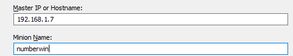

# h6 Akkuna

## v) Lue ja tiivistä artikkeli muutamalla ranskalaisella viivalla. Tässä z-alakohdassa ei tarvitse siis tehdä testejä tietokoneella.

### [Karvinen 2018: Control Windows with Salt](https://terokarvinen.com/2018/04/18/control-windows-with-salt/)

- Artikkeli käy läpi Windowsin kontrolloin saltin kanssa
- Itse kontroillointi näyttää hyvin samanlaiselta kuin Linux koneidenkin kanssa
- Saltin Asentaminen on hieman hankalampaa johtuen Windowsin graafisesta asennu käyttöliittymästä
- Paketinhallinta joka kannattaa laittaa mieleen: Chocolatey

## a) Suolaikkuna. Asenna Salt Windowsiin. Jos ehdit jo asentaa, voit kirjoittaa muistinvaraisesti, mutta muista silloin merkitä, että tämä on muistista kirjoitettu. Näytä testillä (test.ping, file.managed tms), että Salt toimii.

### Salt Windows asennus

Latasin Windows 10 virtuaalikoneelleni Saltin x86 arkkitehtuurin .exe asennuspaketin (https://docs.saltproject.io/en/latest/topics/installation/windows.html) ja käynnistin asennusohjelman. (Salt versio 3004.1.)

Klikkailin nextiä kunnes tuli määrittää Master IP tai Hostname, sekä Minionin nimi.



Jatkoin valitsemalla Install ja asennuksen jälkeen pyysin installeria käynnistämään Salt Minionin.

```
PS C:\Windows\system32> salt-call --local cmd.run 'echo hello'
local:
    hello
```

Paikallisesti näyttäisi toimivan.  

### Salt Master asennus

Koska Saltin version pitää olla vähintään yhtä tuore Masterilla kuin Minioneilla, en asentanut saltia Masterille suoraan perus apt-sourcejen kautta kautta vaan noudatin Salt-Projectin ohjetta uusimman version asennukseen(https://repo.saltproject.io/#debian):

```
$ sudo curl -fsSL -o /usr/share/keyrings/salt-archive-keyring.gpg https://repo.saltproject.io/py3/debian/11/amd64/latest/salt-archive-keyring.gpg
$ echo "deb [signed-by=/usr/share/keyrings/salt-archive-keyring.gpg arch=amd64] https://repo.saltproject.io/py3/debian/11/amd64/latest bullseye main" | sudo tee /etc/apt/sources.list.d/salt.list
deb [signed-by=/usr/share/keyrings/salt-archive-keyring.gpg arch=amd64] https://repo.saltproject.io/py3/debian/11/amd64/latest bullseye main
$ sudo apt-get update
$ sudo apt-get install salt-master
$ sudo salt --version
salt 3004.1
```

Kun versio on varmistettu samaksi, hyväksyin lisätyn avaimen masterilla ja testasin yhteyttä pingaamalla:
```
$ sudo salt-key -A
The following keys are going to be accepted:
Unaccepted Keys:
numberwin
Proceed? [n/Y] Y
Key for minion numberwin accepted
 sudo salt 'numberwin' cmd.run 'echo hello'
numberwin:
    Minion did not return. [No response]
    The minions may not have all finished running and any remaining minions will return upon completion. To look up the return data for this job later, run the following command:
    
    salt-run jobs.lookup_jid 20220509135210277459
ERROR: Minions returned with non-zero exit code
```

Ei toimi, mutta huomasin, ettei myöskään normaali pingaus toimi Masterilta Windows koneelle, mutta toiseen suuntaan kylläkin:
```
## Master
ping 192.168.1.8
PING 192.168.1.8 (192.168.1.8) 56(84) bytes of data.
^C
--- 192.168.1.8 ping statistics ---
54 packets transmitted, 0 received, 100% packet loss, time 54224ms

## Minion
PS C:\Windows\system32> ping 192.168.1.7

Pinging 192.168.1.7 with 32 bytes of data:
Reply from 192.168.1.7: bytes=32 time<1ms TTL=64
Reply from 192.168.1.7: bytes=32 time=1ms TTL=64
Reply from 192.168.1.7: bytes=32 time<1ms TTL=64
```

Löysin tässä vaiheessa perin erikoisen ohjeen vanhemmille Windows -versioille jossa kehotettiin lisäämään yksi jaettu kansio Windows -koneen C-asemalle ongelman ratkaisemiseksi, joten loin c:/share kansion ja laitoin sen jakoon. https://superuser.com/questions/521072/cant-ping-guest-os-in-virtualbox-but-guests-can-ping-host

Pingaus alkoi tämän jälkeen toimia myös masterilta minionille, mutta salt -komennot eivät edelleenkään toimineet. 

## b) Single. Näytä komentorivillä Saltilla (state.single) esimerkit funktioista file ja cmd.

Luodaan tiedosto ja tarvittaessa tiedostopolku:
```
C:\Windows\system32> salt-call --local -l info state.single file.managed c:/important_stuff/hello.txt makedirs=true
[INFO    ] Loading fresh modules for state activity
[INFO    ] Running state [c:/important_stuff/hello.txt] at time 07:07:25.413138
[INFO    ] Executing state file.managed for [c:/important_stuff/hello.txt]
[WARNING ] State for file: c:/important_stuff/hello.txt - Neither 'source' nor 'contents' nor 'contents_pillar' nor 'contents_grains' was defined, yet 'replace' was set to 'True'. As there is no source to replace the file with, 'replace' has been set to 'False' to avoid reading the file unnecessarily.
[INFO    ] {'new': 'file c:/important_stuff/hello.txt created'}
[INFO    ] Completed state [c:/important_stuff/hello.txt] at time 07:07:25.476062 (duration_in_ms=62.924)
local:
----------
          ID: c:/important_stuff/hello.txt
    Function: file.managed
      Result: True
     Comment: Empty file
     Started: 07:07:25.413138
    Duration: 62.924 ms
     Changes:
              ----------
              new:
                  file c:/important_stuff/hello.txt created

Summary for local
------------
Succeeded: 1 (changed=1)
Failed:    0
------------
Total states run:     1
Total run time:  62.924 ms
```


cmd -funktio:
```
PS C:\Windows\system32> salt-call --local -l info state.single cmd.run 'echo hello'                                                            [INFO    ] Loading fresh modules for state activity                                                                                            [INFO    ] Running state [echo hello] at time 07:09:44.381939                                                                                  [INFO    ] Executing state cmd.run for [echo hello]                                                                                            [INFO    ] Executing command 'echo' in directory 'C:\Users\IEUser'                                                                             [INFO    ] {'pid': 5864, 'retcode': 0, 'stdout': 'hello', 'stderr': ''}                                                                        [INFO    ] Completed state [echo hello] at time 07:09:44.413377 (duration_in_ms=31.438)                                                        local:                                                                                                                                         ----------                                                                                                                                               ID: echo hello                                                                                                                           Function: cmd.run                                                                                                                                Result: True                                                                                                                                  Comment: Command "echo hello" run                                                                                                              Started: 07:09:44.381939                                                                                                                      Duration: 31.438 ms                                                                                                                             Changes:                                                                                                                                                ----------                                                                                                                                     pid:                                                                                                                                               5864                                                                                                                                       retcode:                                                                                                                                           0                                                                                                                                          stderr:                                                                                                                                        stdout:                                                                                                                                            hello                                                                                                                                                                                                                                                                       Summary for local                                                                                                                              ------------                                                                                                                                   Succeeded: 1 (changed=1)                                                                                                                       Failed:    0                                                                                                                                   ------------                                                                                                                                   Total states run:     1                                                                                                                        Total run time:  31.438 ms 
```

Kaikki näyttäisi ainakin paikallisesti toimivan.  

## c) IaCcuna. Tee Windowsissa infraa koodina, ja aja se paikallisesti (salt-call --local state.apply foo)  

Tein tilan joka asentaa gitin Windowsiin. Kokeilin luoda /srv/salt hakemiston C:/ProgramData/Salt Project/ sijantiin ja ajaa tilan, mutta se ei toiminut. Kun ajan tilan komennolla `salt --local -l debug state.apply git` välähtää uusi komentorivi edessäni, siihen tulostuu tekstiä ja sitten ikkuna sulkeutuu ilman, että ehdin tuota tekstiä analysoida tarkemmin.   

Loin vielä toisen tilan joka vain printtaa "hello world", mutta tämä toimi samalla tavalla. Käynnistin Powershellin uudestaan ja tulokset muuttuivat: 
```
PS C:\Windows\system32> salt-call --local state.apply hello                                                             local:                                                                                                                      
Data failed to compile:                                                                                             ----------                                                                                                                  
No matching sls found for 'hello' in env 'base'
```

Siirsin srv kansion seuraavaksi sijaintiin C:/ProgramData/Salt Project/Salt ja komennot alkoivat toimia:
```
PS C:\Windows\system32> salt-call --local state.apply hello                                                             local:                                                                                                                  ----------                                                                                                                        
ID: echo hello world                                                                                              
Function: cmd.run                                                                                                         
Result: True                                                                                                           
Comment: Command "echo hello world" run                                                                                 
Started: 06:00:29.463021                                                                                               
Duration: 15.505 ms                                                                                                      Changes:                                                                                                                         ----------                                                                                                              pid:                                                                                                                        828                                                                                                                 retcode:                                                                                                                    0                                                                                                                   stderr:                                                                                                                 stdout:                                                                                                                     
hello world                                                                                                                                                                                                                   
Summary for local                                                                                                       ------------                                                                                                            
Succeeded: 1 (changed=1)                                                                                                
Failed:    0                                                                                                            ------------                                                                                                            
Total states run:     1                                                                                                 
Total run time:  15.505 ms 
```

Tähän riittää toistaiseksi Windowsin kanssa. Palaan takaisin Linuxiin, koska tuo virtuaalikoneella oleva Windowsini pyörii tuskallisen hitaasti.    

## e) Goal. Tee projektisi palautussivu. Voit tehdä sen GitHubiin, kotisivullesi tai mihin vain haluat. Mistä teet miniprojektin? Kuvaile miniprojektin tarkoitus lauseella tai parilla. Asenna käsin (jokin alustava osa) projektistasi ja ota ruutukaappaus siitä, miten lopputulosta käytetään. Tietysti pääset tekemään paremman ruutukaappauksen, kun projektisi on valmis. Valitse projektille lisenssi (suosittelen GPL 2, voit valita lisenssin vapaasti). Laita sivulle nimesi (tai jos haluat, nimimerkki, mutta suosittelen nimeä). Ja lähdekoodiksi vaikkapa vain Saltin hei maailma. Kirjoita ohje, miten projektisi otetaan käyttöön. Kirjoita projektin kypsyys näkyviin, tässä vaiheessa se on varmaankin alpha, eli vasta aloitettu eikä vielä voi varsinaisesti edes kunnolla testata. Yritä tehdä sivu, jossa tärkeimmät asiat näkyvät taitoksen yllä (skrollaamatta): tarkoitus, ruutukaapaus, lisenssi, nimesi, latauslinkki, kypsyysaste (alpha). Tässä vaiheessa projektin ei vielä tarvitse toimia, vaan kaikkiin osiin tehdään vielä parannuksia. Voit kirjoittaa englanniksi tai suomeksi, suosittelen englantia.

Linkki palautusprojektin sivulle: https://github.com/pajaz/final-module-linux-conf-mgmt2022

## f) Palauta linkki raporttiisi Laksuun.

## g) Anna tästä tehtävästä palaute vähintään kahdelle opiskelukaverille Laksussa.

